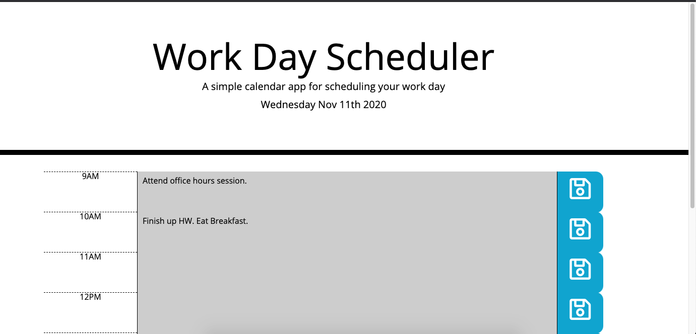

# day-planner
A simple day planner that you can use to plan out your daily 9-5 schedule. We were provided with a simple HTML and CSS file, that had the basic structure and styles set up for us. I set up the structure of the planner and used jquery to set up the functionality of the planner. The planner is set up to do the following. 

* On page load it displays the current date at the top of the page. 
* Each time block is color coded so that the user can identify which time blocks have occured, are currently happening and will happen. 
* When the user clicks on each time block, they can input a task into that time block. 
* When the user clicks on the save button, the tasks that they enter into that time block get saved into local storage, and on page refresh the tasks that the user entered are still visible. 

# Libraries used to complete this project 
The following libraries were used to create this project. 

* Bootstrap - used for styling of page. 
* Moment JS - used to handle date and time calculations
* JQuery - used to set up color-coding, and other interactive functionality on page. 

# Screenshot of final project

# Link to deployed project 

* [Link to deployed site](https://v-lax.github.io/day-planner/html/index.html)
